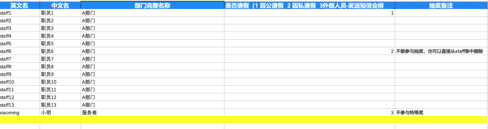

<h1>抽奖程序使用说明</h1>

# 目录
- [部署安装](#1-部署安装)
- [使用流程](#2-使用流程)
- [其他说明](#3-其他说明)

# 1 部署安装
- Saas部署
  - `python manage.py migrate`
  - `python manage.py init`
- windows系统
  - 双击installer.bat安装依赖包
  - 双击run.bat启动抽奖程序
- mac/linux系统
  - 安装python 3.6.8 
    - mac: `brew install python3.6.8`  
    - linux(ubuntu): `apt install python3.6.8`
  - 安装pip
    - mac: 完成第一步后自带pip
    - linux(ubuntu): `apt install python3.6-pip` 
  - 安装依赖包
    - 命令行运行`./install.sh`
  - 启动程序
    - 命令行运行`./run.sh`
- docker部署
  - 命令行运行`docker build -t lottery_name .`来构建docker镜像，lottery_name为构建的镜像的名称，由用户指定
  - 命令行运行`docker run -d -p port:8080 lottery_name`来启动docker镜像，port为通过主机来访问抽奖系统的端口号，由用户指定
  - 对应镜像的容器启动完成后可通过访问`http://localhost:port/` 来对抽奖程序进行访问

# 2 使用流程
- 步骤一 下载人员信息模版(excel json)
- 步骤二 导入人员信息
- 步骤三 创建奖项，并将奖项的状态置为`已激活`
- 步骤四 在首页看查已激活的奖项，并点击开始抽奖
- 步骤五 看查中奖人员名单，并导出为excel表格

# 3 使用说明
### 3.1 导入抽奖人员及其头像
- 下载模版
  - 导入格式：excel 和 json
  
  - 表格说明：
    - 英文名和中文名，且英文名`rtx`要唯一
    - 部门名称
    - 是否请假：在创建奖项可以选择是否请假的人员可以参与抽奖
- 上传抽奖人员名单
  - 上传抽奖人员名单后可以关联到奖项，在指定的人员名单中选取中奖者
- 导入抽奖者头像
  - 抽奖者的头像命名为`{英文名}.png`
  - 将头像文件夹放在`static/avatars/{portrait_packet_name}`, 其中`portrait_packet_name`是在配置中加入的该文件夹的名称，默认值`head_portrait`
  - 如果上述路径中没有候选者的头像，则会使用`static/avators`文件夹下的`default.png`默认头像
  

### 3.2 添加奖项
- 输入一些奖项的基本配置，并上传图片
- 部分奖项配置说明
    - 状态：只有激活的奖项才可以进行抽奖
    - 是否现场输入商品：勾选之后，奖项的配置(奖项配置、奖品、中奖人数)会以文本框的形式渲染，可以输入修改配置
    - 是否现场领奖：勾选之后，若中奖者不在现场，则可以重新抽奖，会将刚才不在现场的中奖者的中奖记录标为无效
    - 报备的人是否可以抽奖：勾选之后，请假的人员会作为抽奖的样本
    - 相关奖项：若奖项A与奖项B关联，则奖项A的中奖者会作为奖项B的抽奖样本
    - 中奖人数：要符合条件`总中奖人数 = 名单1的中奖人数 + 名单2中奖人数`
    - 注意：若要在同一个奖项里导入两份名单，则需要保证两份名单里的人员不能重复，否则抽奖时会出现人员重复的问题。建议在设置奖项时只导入一份名单
    
### 3.3 进行抽奖
- 选择想要抽奖的奖项
- 点击开始按钮，参加抽奖人员的头像会有飞出的动画
- 点击停止按钮会出现中奖结果的界面
- 若设置了`必须现场领奖`则可以点击没在场的人员头像进行重新抽奖，进行重新抽奖是单独针对没有在场的人员进行随机抽取，而不是对所有中奖人员进行随机抽取
  

### 3.4 看查/导出 中奖者名单
- 可以看查中奖人员名单
- 可以将中奖人员名单导出为excel表格
  

### 3.5 排除重复中奖人员
- 在添加奖项时勾选 "中奖人员是否加到排除名单"
- 中奖后添加到排除名单中的人员不会再作为其余奖项的抽取样本，无法再中其余的奖项
- 此排除为永久排除，若之前的奖项被删除，依旧会保持中奖人员的排除状态
  

# 4 其他说明
### 4.1 抽奖逻辑流程图

### 4.2 配置项说明

- 配置抽奖奖项的标题颜色
  - 找到conf_name为award_p_color的配置项，并修改conf_value（单位：十六进制颜色值)
  

- 配置中奖结果的动态播放效果(中奖人数过多)
  - 找到conf_name为pageturning的配置项（翻页方式参数：上下翻页（vertical）、左右翻页（horizontal）），并修改值为horizontal
  - 找到conf_name为is_play的配置项（开启轮播开关：开启，默认（true）、关闭（false）），并修改值为false
  - 找到conf_name为effect的配置项（轮播效果：推动效果（default）、不断重复轮播的渐变效果（fade）、立方体效果（cube）、封面流效果（coverflow）、翻转效果（flip）、卡片效果（cards）、系统默认原始风格（空字符串 或 null）），并修改值为default
  - 找到conf_name为is_end_play的配置项（到最后一页停止轮播：默认轮播到最后一页停止（true）、不断从头开始轮播（false）），并修改值为true
  - 参数time_interval，用于设置翻页间隔时长，中奖结果轮播，每页显示的间隔时间，默认1秒（单位：秒）
  - 参数time_presentation，用于设置翻页停留时长，中奖结果轮播，每页呈现的停留时长，默认1秒（单位：秒）
  
- 配置中奖结果显示人员姓名和头像模式
  - 此模式用于48人以内（包括48）的抽奖人员则以中奖者头像展示，超过48人的奖项，中奖结果则以纯人名作为展示样式。
  - 注意事项
    - 头像尺寸建议不要过大，建议大小为150，系统内置的default.png大小和像素如图
    - 优先将抽奖候选人员头像放置到 `avatars/head_portrait` 目录下，然后导入制作的抽奖人员名单。如果先导入抽奖人员名单 或 抽奖人员对应的头像不存在，中奖结果则使用系统默认的default.png作为人员头像。
  - 必配参数
    - 找到conf_name为head_portrait_style的配置项，并修改conf_value，值为：null
    - 找到conf_name为icon_package的配置项，并修改conf_value，值为：head_portrait
    - 找到conf_name为effect的配置项，并修改conf_value，值为：null
  - 可选参数
    - 参数winner_nums，用于超过48人的奖项，设置每页最大展示的人数，默认48（正整数）
    
    
- 配置中奖结果为小方块模式，并设置字体颜色、背景颜色和字体
  - 找到conf_name为head_portrait_style的配置项，并修改conf_value，值为：non_head_portrait，表示：只有中奖者中英文姓名
  - 找到conf_name为winner_backgroud_color的配置项（中奖结果方块背景色,单位：十六进制颜色值），并修改conf_value，此处测试值为 #000000
  - 找到conf_name为winner_p_color的配置项（中奖结果名单的字体色，单位：十六进制颜色值），并修改conf_value，此处测试值为 #ffffff
  - 找到conf_name为font_family的配置项（只支持：字体FZZZHONGJW、为空则使用系统默认字体），并修改conf_value，此处测试值为 FZZZHONGJW
- 抽奖界面风格配置
  - 找到conf_name为award_style的配置项（抽奖的奖项展示风格支持：水滴风格（0）、稳赢风格（1）、玩偶风格（2）、星空风格（3）、带对应奖项logo图片风格（4））
  
- 配置页面底部和技术支持元素内容
  - 找到conf_name为author_name的配置项（页面底部和技术支持元素内容，默认为空），并修改conf_value
    
- 配置是否需要顶部的图标
  - 找到conf_name为need_top的配置项,（是否需要顶部中间的图标：需要（true）、不需要（false）），此处设置为true
  - 找到conf_name为need_top_left的配置项（是否需要顶部左边的图标：需要（true）、不需要（false）），此处设置为true
    

### 4.3 背景图片的更改
- 在`static/images/`文件夹下创建`bg{num}`文件夹，其中`num`为版本号且全局唯一，并在配置表中`award_style`配置选项中填写唯一的版本号。
- 在`bg{num}`文件夹下的图片说明如下
  - `packet_bg.jpg`  背景图片
  - `top.png` 顶部装饰小图标
  - `end_bg.jpg` 结束背景，也即抽奖时和抽奖后展示中奖者的背景图
  - `lucky.png` 幸运大抽奖的标题
  - `start.png` 开始按钮
  - `stop.png` 结束按钮

### 4.4 管理页面的使用

- 管理页面的项目说明
  - 用户：显示当前登陆的用户
  - 配置表：在这里修改配置项
  - 中奖人员：显示中奖的人员以及对应的奖项
  - 奖项：显示设置的奖项的详细信息，删除奖项会同步删除对应的中奖人员
  - 排除名单ForAll：显示中奖后被排除的人员
  - Staff：显示通过导入名单来导入的人员，包含人员的英文名、中文名、导入该人员的名单名称，缺席原因，头像等信息。缺席原因分为四种，分别是：未缺席、因公请假、因私请假、外部人员
  - 名单：显示导入人员的名单的名称。若要删除名单需要先删除使用该名单的奖项。并且删除名单将会同步删除根据该名单所导入的人员

### 4.5 轮播时出现的问题
- 在翻页方式采用上下翻页时部分机器会出现乱码问题，左右翻页时则不会出现乱码的问题
- 建议使用抽奖系统时采用左右翻页的方式，如果需要上下翻页，则需要特别关注一下是否会出现乱码问题